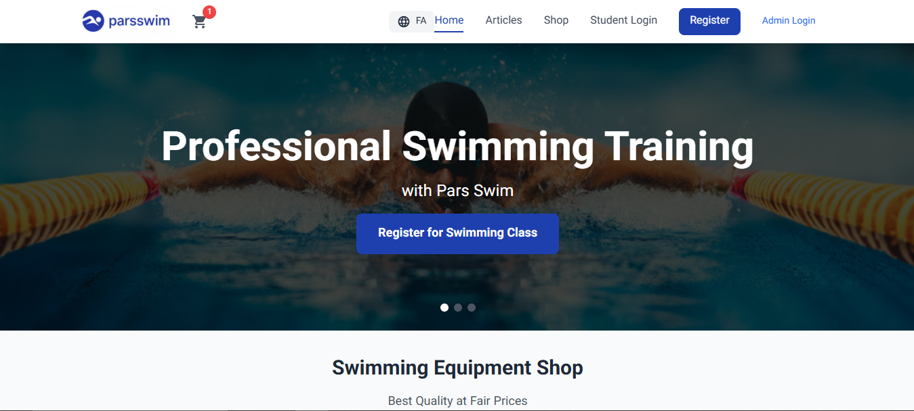
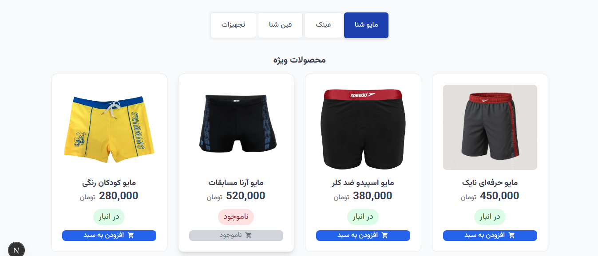
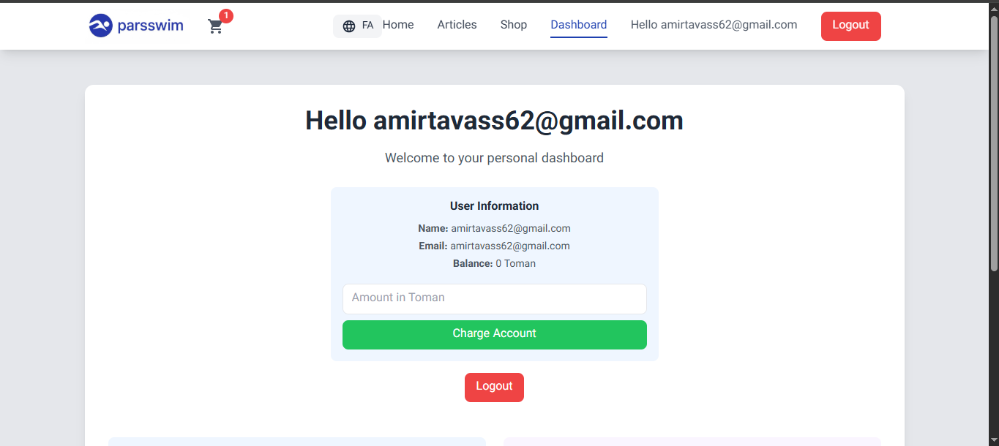

# 🏊‍♂️ Pars Swim - Professional Swimming Instructor Platform

A comprehensive full-stack web application for swimming instructors built with **Next.js 15** and **Node.js/Express**, featuring class management, multi-language support, e-commerce and integrated payment processing.

## 🌐 Live Demo

**Main Website**: [https://parsswim.ir](https://parsswim.ir)  
**Backend API**: [https://parsswim-backend-production.up.railway.app/](https://parsswim-backend-production.up.railway.app/)

## 🎯 About

Pars Swim is a complete swimming instruction management platform that combines professional coaching services with an integrated e-commerce store. The platform serves both swimming instructors and students with comprehensive booking, payment, and management features.

## 📱 Screenshots

**Homepage with Hero Section**

<!-- Add your screenshot here -->

![Homepage]


**Products Shop**

<!-- Add your screenshot here -->

![Products]


**Student Dashboard**

<!-- Add your screenshot here -->



## ✨ Features

### 🏠 **Frontend Features**

- **Bilingual Support**: English (default) and Persian/Farsi with RTL layout
- **Responsive Design**: Mobile-first approach with modern UI/UX
- **Hero Section**: Dynamic sliding hero with professional imagery
- **Class Booking System**: Real-time availability and registration
- **E-commerce Store**: Swimming equipment and accessories shop
- **Student Dashboard**: Personalized interface with booking history
- **Coach Resume**: Professional qualifications and experience showcase
- **Educational Articles**: Swimming technique guides and tips

### 🛡️ **Authentication & Security**

- **Multi-role System**: Student, Admin roles
- **JWT Authentication**: Secure token-based authentication
- **Protected Routes**: Role-based access control

### 💰 **Payment & E-commerce**

- **Shopping Cart**: Add to cart and checkout functionality
- **Product Management**: Complete CRUD operations for products

### 👨‍🏫 **Admin Panel**

- **Student Management**: Registration overview and user management
- **Class Management**: Create, edit, and manage swimming classes
- **Product Management**: Add/edit products with image upload
- **Payment Tracking**: Monitor transactions and payments
- **Analytics Dashboard**: Student registration and revenue insights

### 🏊‍♂️ **Class Management**

- **Multiple Class Types**: Private lessons, group classes, trial sessions
- **Flexible Scheduling**: Date and time management for instructors
- **Registration System**: Automated enrollment and confirmation

## 🛠 Tech Stack

### Frontend

- **Framework**: Next.js 15 (App Router)
- **Styling**: Tailwind CSS
- **Language**: Multi-language support (English/Persian)
- **Font**: Vazirmatn (Persian) + Inter (English)
- **Icons**: React Icons
- **State Management**: React Query + Context API
- **HTTP Client**: Axios

### Backend

- **Runtime**: Node.js
- **Framework**: Express.js
- **Database**: MongoDB with Mongoose ODM
- **Authentication**: JWT + Passport.js
- **File Upload**: Multer
- **Validation**: Express Validator
- **Security**: Helmet, CORS, Rate Limiting

### Infrastructure

- **Frontend Hosting**: Vercel
- **Backend Hosting**: Railway
- **Database**: MongoDB Atlas
- **File Storage**: Railway Volume Storage
- **Domain**: Custom domain with SSL

## 🚀 Getting Started

### Prerequisites

- Node.js 18+
- MongoDB (local or Atlas)
- npm, yarn, or pnpm

### Backend Setup

1. Clone the repository:

```bash
git clone https://github.com/YOUR_USERNAME/parsswim-backend.git
cd parsswim-backend
```

2. Install dependencies:

```bash
npm install
```

3. Create `.env` file:

```bash
MONGODB_URL=your_mongodb_connection_string
JWT_SECRET=your_jwt_secret
PORT=4000
NODE_ENV=development
```

4. Seed the database (optional):

```bash
node database-seeder.js
```

5. Start the server:

```bash
npm run dev
```

### Frontend Setup

1. Clone the frontend repository:

```bash
git clone https://github.com/YOUR_USERNAME/parsswim-frontend.git
cd parsswim-frontend
```

2. Install dependencies:

```bash
npm install
```

3. Configure environment variables:

```bash
NEXT_PUBLIC_API_URL=http://localhost:4000
# or for production:
NEXT_PUBLIC_API_URL=https://parsswim-backend-production.up.railway.app
```

4. Run the development server:

```bash
npm run dev
```

5. Open [http://localhost:3000](http://localhost:3000) to view the application.

## 📱 Application Structure

```
Frontend Pages:
/                   # Landing page with hero and services
/articles          # Swimming technique guides
/products          # E-commerce shop
/register          # Student registration form
/login             # Student login
/dashboard         # Student dashboard
/admin             # Admin panel
/admin/login       # Admin authentication

Backend API Routes:
/api/auth          # Authentication endpoints
/api/users         # User management
/api/classes       # Class CRUD operations
/api/products      # Product management
/api/registrations # Class registrations
/api/payments      # Payment processing
/api/admin         # Admin operations
```

## 🎨 Design Features

- **Modern UI/UX**: Clean, professional interface with smooth animations
- **Accessibility**: Semantic HTML, proper contrast, and keyboard navigation
- **RTL Support**: Complete right-to-left layout for Persian content
- **Mobile Responsive**: Optimized for all device sizes
- **Performance**: Optimized images, lazy loading, and efficient caching
- **SEO Optimized**: Proper meta tags, structured data, and sitemap

## 🔧 Advanced Features

### Multi-language Implementation

- Context-based language switching
- RTL/LTR layout support
- Localized date and number formatting
- Dynamic content translation

### Real-time Updates

- Live class availability updates
- Real-time payment status
- Instant registration confirmations

### Security Features

- Input sanitization and validation
- SQL injection prevention
- XSS protection
- Rate limiting
- Secure file uploads

## 🚀 Deployment

### Frontend (Vercel)

```bash
npm run build
# Deploy to Vercel
```

### Backend (Railway)

```bash
# Connect Railway CLI
railway login
railway deploy
```

### Database (MongoDB Atlas)

- Set up MongoDB Atlas cluster
- Configure network access and users
- Update connection strings

## 📊 Performance Optimizations

- **Image Optimization**: Next.js Image component with proper sizing
- **Code Splitting**: Automatic route-based code splitting
- **Caching**: Browser caching and API response caching
- **Bundle Analysis**: Optimized bundle size and tree shaking
- **Database Indexing**: Proper MongoDB indexes for queries

## 🔐 Security Considerations

- Environment variable protection
- CORS configuration
- Helmet.js security headers
- Input validation and sanitization
- JWT token expiration
- Password hashing with bcrypt

## 📧 Contact & Support

**Developer**: Amir Tavassoli

- **Portfolio**: [https://amir-portfolio-zeta.vercel.app/](https://amir-portfolio-zeta.vercel.app/)
- **Email**: [amirtavass62@gmail.com](mailto:amirtavass62@gmail.com)
- **Website**: [https://parsswim.ir](https://parsswim.ir)

---

## 🏊‍♂️ For Swimming Instructors

This platform is specifically designed for swimming coaches and aquatic instructors who want to:

- **Streamline Operations**: Manage classes, students, and payments in one place
- **Increase Revenue**: Sell equipment and offer various class types
- **Professional Presence**: Showcase qualifications and build credibility
- **Student Experience**: Provide modern, user-friendly booking system
- **Business Growth**: Analytics and insights for business decisions

---

## 🔧 For Developers

This project demonstrates advanced full-stack development including:

- **Modern React Patterns**: Hooks, Context, Custom hooks
- **Next.js Best Practices**: App Router, Image optimization, SEO
- **Backend Architecture**: RESTful APIs, middleware, error handling
- **Database Design**: MongoDB schemas, relationships, indexing
- **Authentication Flow**: JWT implementation, role-based access
- **Payment Integration**: Secure transaction handling
- **Multi-language Support**: i18n implementation with RTL
- **DevOps**: Deployment, environment configuration, monitoring

**Perfect for**: Swimming instructors, fitness trainers, sports coaches, or any service-based business requiring comprehensive booking and e-commerce functionality.

---

## 📄 License

This project is proprietary software. All rights reserved.

---

_Professional swimming instruction management platform - Built with modern web technologies for optimal performance and user experience._
